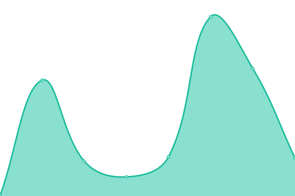

# [📈 Live Status](https://hayloftadvisors.com): <!--live status--> **🟧 Partial outage**

This repository contains the open-source uptime monitor and status page for [Hayloft Labs](https://hayloftadvisors.com), powered by [Upptime](https://github.com/upptime/upptime).

With [Upptime](https://upptime.js.org), you can get your own unlimited and free uptime monitor and status page, powered entirely by a GitHub repository. We use [Issues](https://github.com/hayloftlabs/hayloft-website-upptime/issues) as incident reports, [Actions](https://github.com/hayloftlabs/hayloft-website-upptime/actions) as uptime monitors, and [Pages](https://hayloftadvisors.com) for the status page.

<!--start: status pages-->
<!-- This summary is generated by Upptime (https://github.com/upptime/upptime) -->
<!-- Do not edit this manually, your changes will be overwritten -->
<!-- prettier-ignore -->
| URL | Status | History | Response Time | Uptime |
| --- | ------ | ------- | ------------- | ------ |
|  [Hayloft Advisors Website](https://hayloftadvisors.com) | 🟩 Up | [hayloft-advisors-website.yml](https://github.com/hayloftlabs/hayloft-website-upptime/commits/HEAD/history/hayloft-advisors-website.yml) | 

 400ms
     
 | 

<a href="https://hayloftlabs.github.io/hayloft-website-upptime/history/hayloft-advisors-website">100.00%</a>
    

|  Hayloft Chatbot | 🟩 Up | [hayloft-chatbot.yml](https://github.com/hayloftlabs/hayloft-website-upptime/commits/HEAD/history/hayloft-chatbot.yml) | 

 636ms
     
 | 

<a href="https://hayloftlabs.github.io/hayloft-website-upptime/history/hayloft-chatbot">99.60%</a>
    

|  Hayloft n8n Prod | 🟥 Down | [hayloft-n8n-prod.yml](https://github.com/hayloftlabs/hayloft-website-upptime/commits/HEAD/history/hayloft-n8n-prod.yml) | 

 752ms
     
 | 

<a href="https://hayloftlabs.github.io/hayloft-website-upptime/history/hayloft-n8n-prod">93.58%</a>
    

|  Hayloft n8n Dev | 🟥 Down | [hayloft-n8n-dev.yml](https://github.com/hayloftlabs/hayloft-website-upptime/commits/HEAD/history/hayloft-n8n-dev.yml) | 

 1316ms
     
 | 

<a href="https://hayloftlabs.github.io/hayloft-website-upptime/history/hayloft-n8n-dev">71.74%</a>
    

|  [LPPRSWW, PLLC](https://lpprsww.com) | 🟩 Up | [lpprsww-pllc.yml](https://github.com/hayloftlabs/hayloft-website-upptime/commits/HEAD/history/lpprsww-pllc.yml) | 

 479ms
     
 | 

<a href="https://hayloftlabs.github.io/hayloft-website-upptime/history/lpprsww-pllc">100.00%</a>
    

|  GCR public instance 01 | 🟩 Up | [gcr-public-instance-01.yml](https://github.com/hayloftlabs/hayloft-website-upptime/commits/HEAD/history/gcr-public-instance-01.yml) | 

 1344ms
     
 | 

<a href="https://hayloftlabs.github.io/hayloft-website-upptime/history/gcr-public-instance-01">100.00%</a>
    

|  GCR public instance 02 | 🟩 Up | [gcr-public-instance-02.yml](https://github.com/hayloftlabs/hayloft-website-upptime/commits/HEAD/history/gcr-public-instance-02.yml) | 

 981ms
     
 | 

<a href="https://hayloftlabs.github.io/hayloft-website-upptime/history/gcr-public-instance-02">100.00%</a>
    

|  Hayloft n8n GCE 01 | 🟩 Up | [hayloft-n8n-gce-01.yml](https://github.com/hayloftlabs/hayloft-website-upptime/commits/HEAD/history/hayloft-n8n-gce-01.yml) | 

 655ms
     
 | 

<a href="https://hayloftlabs.github.io/hayloft-website-upptime/history/hayloft-n8n-gce-01">98.40%</a>
    

|  Hayloft n8n GCE 02 | 🟩 Up | [hayloft-n8n-gce-02.yml](https://github.com/hayloftlabs/hayloft-website-upptime/commits/HEAD/history/hayloft-n8n-gce-02.yml) | 

 611ms
     
 | 

<a href="https://hayloftlabs.github.io/hayloft-website-upptime/history/hayloft-n8n-gce-02">98.40%</a>
    

|  Hayloft n8n GCE 03 | 🟩 Up | [hayloft-n8n-gce-03.yml](https://github.com/hayloftlabs/hayloft-website-upptime/commits/HEAD/history/hayloft-n8n-gce-03.yml) | 

 136ms
     
 | 

<a href="https://hayloftlabs.github.io/hayloft-website-upptime/history/hayloft-n8n-gce-03">100.00%</a>
    

|  [Sun Moon Heart Breath](https://sunmoonheartbreath.com) | 🟩 Up | [sun-moon-heart-breath.yml](https://github.com/hayloftlabs/hayloft-website-upptime/commits/HEAD/history/sun-moon-heart-breath.yml) | 

 548ms
     
 | 

<a href="https://hayloftlabs.github.io/hayloft-website-upptime/history/sun-moon-heart-breath">100.00%</a>
    

<!--end: status pages-->

[**Visit our status website →**](https://hayloftadvisors.com)

## 📄 License

- Powered by: [Upptime](https://github.com/upptime/upptime)
- Code: [MIT](./LICENSE) © [Anand Chowdhary](https://anandchowdhary.com), supported by [Pabio](https://pabio.com)
- Data in the `./history` directory: [Open Database License](https://opendatacommons.org/licenses/odbl/1-0/)
